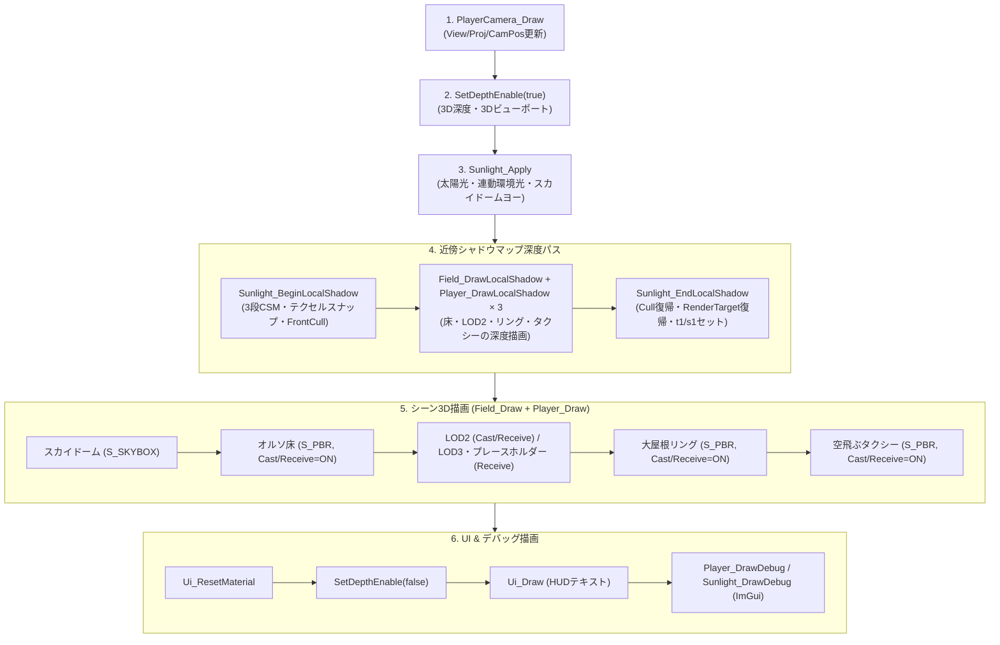
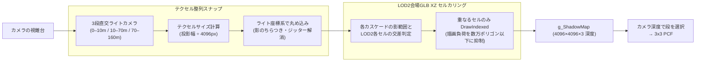

# 万博ゲーム レンダリング・ライティング仕様書

## 1. この資料の目的

この資料は、`expogame` における万博会場（`SCENE_GAME`）の3D描画パイプライン、HDR画像のプリプロセスから抽出する平行太陽光、連動環境光、GGXベースのPBRシェーディング、全モデルが受影し建物はLOD2を投影元とする近傍シャドウマップ、HDRを表示用に変換したスカイドーム、および ImGui によるリアルタイム調整の設計と実装仕様を整理する。

全体仕様は [game_specification.md](game_specification.md)、タスク進捗は [task_list.md](task_list.md)、会場都市モデルは [plateau.md](plateau.md)、フレームワーク仕様は [../document_framework/framework_usage.md](../document_framework/framework_usage.md) を参照する。

---

## 2. 描画パイプラインとフレーム処理順

`SCENE_GAME` の1フレームの描画は [`SCENE_GAME/game.cpp`](../SCENE_GAME/game.cpp) の `Game_Draw` を起点とする。シャドウマップ深度パスを通常描画の直前に実行し、同一フレーム内でその深度テクスチャを参照して PBR 直接光に影を反映する。



### 描画ステップ詳細

1. **`PlayerCamera_Draw`**: カメラ座標・注視点からビュー行列・射影行列・カメラ位置（`g_CameraBuffer` / `b5`）を GPU へ送る。
2. **`SetDepthEnable(true)`**: 3D 用深度ステンシルステートおよびフル解像度ビューポート（3840×2160）を適用。
3. **`Sunlight_Apply`**: 起動時の方位 `-170.0°`、HDRから抽出した仰角・色、既定強度 `2.00`（いずれもImGuiで変更可能）から平行光定数バッファ（`g_LightBuffer` / `b4`）およびマテリアルパラメータ（`g_ParameterBuffer` / `b6`）を設定し、スカイドームの回転角度を更新。
4. **近傍シャドウマップ作成パス**:
   - `Sunlight_BeginLocalShadow`: カメラ視錐台を3段（既定 `0–10m / 10–70m / 70–160m`）に分け、各段の直交投影ライトカメラを構築。テクセル整列スナップを行い、カスケード0の深度ビューへ切り替える。アクネ防止のため `CULLSTATE_FRONT`（前面カリング＝裏面深度書き込み）を設定。
   - `Field_DrawLocalShadow` と `Player_DrawLocalShadow`: 床、LOD2、遠景LOD2、大屋根リング、空飛ぶタクシーをカスケードごとに `S_SHADOW_MAP` で深度バッファへ描画する。LOD3パビリオンとプレースホルダーは影を受けるが投影しない。会場GLBは近傍XZセルでカリングし、タクシーはメッシュ全体を投影する。
   - `Sunlight_EndLocalShadow`: 通常の画面レンダーターゲットへ復帰し、カリングを `CULLSTATE_NONE` に戻す。3スライスの深度テクスチャ配列をピクセルシェーダーの `t1`、サンプラーを `s1` にバインド。
5. **メイン描画パス**:
   - `Field_Draw`: スカイドーム、床、LOD2タイル、遠景LOD2、LOD3パビリオン、プレースホルダー、リングの順で描画する。各モデルは `S_PBR` でglTF PBRマテリアルを処理する。
   - `Player_Draw`: 空飛ぶタクシー（`flytaxi.glb`）を描画。
6. **2D・UI・デバッグパス**:
   - `Ui_ResetMaterial`: マテリアル色を白（ディフューズ 1.0）へ戻す。
   - `SetDepthEnable(false)`: 2D 用 UI ビューポート（1280×720）へ切り替え。
   - `Ui_Draw`, `Player_DrawDebug`, `Sunlight_DrawDebug`: HUD および ImGui ウィジェットを描画。

---

## 3. アセット別レンダリング構成一覧

万博会場を構成する各アセットの適用シェーダー、マテリアル特性、シャドウマップ設定、および固定配置パラメータは以下の通りである。

| アセット | モデルファイル | 適用シェーダー | シャドウ投光 (Cast) | 影受け (Receive) | テクスチャ仕様 / 解像度 | 固定配置オフセット | 備考 |
| :--- | :--- | :--- | :---: | :---: | :--- | :--- | :--- |
| **オルソ床** | `asset/expomodel/expo_floor.glb` | `S_PBR` | **○** (近傍セル) | **○** | 最大 8192×3640（縮小例外、VRAM約256MB） | Y: `-0.080` (`EXPO_FLOOR_SINK`) | 大屋根リングと同一の PBR（拡散 `/π`、頂点法線、ピーク正規化）。法線は ECEF 三角形を glTF Y-up へ変換したもの。定数 `(0,1,0)` は使わない |
| **大屋根リング** | `asset/expomodel/expo_ring.glb` | `S_PBR` | **○** (近傍セル) | **○** | 公式 appearance JPEG 22枚 + 単色 4枚 | Y: `-1.550` (`EXPO_RING_Y_OFFSET`) | 約90.6万ポリゴン。XZセル分割で影パスをカリング |
| **LOD2タイル** | `asset/expomodel/expo_tile_lod2.glb` | `S_PBR` | **○** (近傍セル) | **○** | 長辺 2048px 上限（WIC縮小） | Y: `-9.010` (`EXPO_BUILDING_Y_OFFSET`) | パンチ済みタイル4枚 |
| **未パンチLOD2遠景** | `asset/expomodel/expo_tile_far.glb` | `S_PBR` | **○** (近傍セル) | **○** | 長辺 2048px 上限（WIC縮小） | Y: `-9.010` (`EXPO_BUILDING_Y_OFFSET`) | LOD3常駐時にバッチ単位で排他非表示 |
| **LOD3パビリオン** | `asset/expomodel/expo_pavilion_*.glb` | `S_PBR` | × | **○** | 長辺 2048px 上限（WIC縮小） | Y: `-9.010` (`EXPO_BUILDING_Y_OFFSET`) | 距離ストリーミング（開始 24、破棄 36）。影は表示中もLOD2を投影元とする。全GLBでglTFのPBR係数・packed ORM・法線・エミッシブを共通処理 |
| **プレースホルダー** | `asset/model/cube.fbx` | `S_PBR` | × | **○** | 単色マテリアル | 各建物の配置座標 | LOD3 の GPU 化進行中に表示。影はLOD2を投影元とする |
| **プレイヤー機体** | `asset/model/flytaxi.glb` | `S_PBR` | **○** | **○** | 組み込みテクスチャ | ホバー移動座標 | 表示長辺約 0.8 にスケール |
| **スカイドーム** | `asset/model/basic_skybox_3d.fbx` | `S_SKYBOX` | × | × | `asset/texture/pizzo_pernice_puresky_4k.hdr` をReinhard変換した `R8G8B8A8_UNORM` | スケール 1000、Pitch 0°、カメラ位置追従 | ワールド方向から正距円筒UVを計算し、太陽方位に追従して Yaw 回転 |

---

## 4. ライティングとシェーディング仕様

ライティングの統括は [`SCENE_GAME/sunlight.cpp`](../SCENE_GAME/sunlight.cpp)、HDRの読み込みと表示用変換は [`framework/texture.cpp`](../framework/texture.cpp)、PBR シェーダーの実装は [`shader/PBRShaderVS.hlsl`](../shader/PBRShaderVS.hlsl) および [`shader/PBRShaderPS.hlsl`](../shader/PBRShaderPS.hlsl) が担当する。

### 4.1 太陽光（ディレクショナルライト）

太陽光は、`asset/texture/pizzo_pernice_puresky_4k.hdr` を起動時に一度だけプリプロセスして得た単一の平行光源として、定数バッファ `LightBuffer`（`b4`）に書き込まれる。HDRの読み込みには DirectXTex の `LoadFromHDRFile` を使用する。

#### HDRからの太陽抽出（簡易プリプロセス）

HDRの各画素から線形輝度を計算し、最大輝度を基準にしたしきい値マスクを4連結セグメンテーションする。正距円筒図法の左右端は接続し、テクスチャシーム上の太陽を分割しない。

1. 輝度 \(L = 0.2126R + 0.7152G + 0.0722B\)
2. しきい値 \(L \geq 0.5 \times L_{\max}\) の画素を抽出
3. 4連結成分のうち、輝度合計が最大の成分を太陽として選択
4. 輝度重み付き重心からUVを求める（Uは円周上の重心）
5. UVをスカイドームと共通の正距円筒図法の方向ベクトルへ逆変換する。`u=0.5` を `+X`、`v=0` を天頂とし、Pitch `90°` やYaw基準 `200°` の焼き込みは行わない

選択成分の輝度重み平均を最大チャンネルで正規化したものを直接光色とする。強度は太陽平均輝度と空平均輝度の比を対数変換し `0.80〜3.50` に収める。抽出した強度は解析値として保持するが、ゲーム起動時とReset時の既定値は `2.00` とする。方位はHDR抽出値をそのまま使わず、ゲーム起動時とReset時に `-170.0°` を使用する。HDRの読み込みまたは抽出に失敗した場合は、解析データのフォールバックとして方位 `-111.5°`、仰角 `63.4°`、色 `(1.0, 0.91, 0.90)`、強度 `2.00` を保持する。

- **光線方向ベクトル**: ImGuiまたは既定値で設定された方位角 \(\theta_{\text{az}}\)（Azimuth）と、HDR抽出値またはImGuiで設定された仰角 \(\theta_{\text{el}}\)（Elevation）から計算される太陽の空間ベクトル \(\mathbf{v}_{\text{sun}}\) の反転方向。
  \[
  \mathbf{v}_{\text{sun}} = \begin{pmatrix} \cos\theta_{\text{el}} \sin\theta_{\text{az}} \\ \sin\theta_{\text{el}} \\ \cos\theta_{\text{el}} \cos\theta_{\text{az}} \end{pmatrix}, \quad \text{Direction} = -\mathbf{v}_{\text{sun}}
  \]
- **平行光判定**: `Position.w == 0.0f` によりピクセルシェーダー内で平行光と判定（距離減衰なし）。
- **光強度**: `PointLightParam.y = g_Intensity`（起動時とReset時は `2.00`）。
- **鏡面反射倍率**: `PointLightParam.z = 1.0f`。

### 4.2 連動環境光（アンビエント）

単一の環境光色ではなく、太陽高度（仰角）と空光の色味をブレンドした環境光を動的に生成する。

- **仰角係数**:
  \[
  k_{\text{elev}} = 0.20 + 0.80 \times \text{saturate}(\sin\theta_{\text{el}})
  \]
- **空色ブレンド**: 空色ティント \(\mathbf{c}_{\text{sky}} = (0.55, 0.70, 1.00)\) と太陽色 \(\mathbf{c}_{\text{sun}}\) を 35% : 65% の比率で合成。
  \[
  \mathbf{c}_{\text{ambient}} = \left( \mathbf{c}_{\text{sun}} \times (1 - 0.35) + \mathbf{c}_{\text{sky}} \times 0.35 \right) \times \text{AmbientScale} \times k_{\text{elev}}
  \]
- ピクセルシェーダーは環境光色を 1 でクリップしない。`Ambient Scale` 既定は `0.8`（ImGui 0〜4）。日中の陰影部がアルベドに近い明るさになる。
- これにより、太陽が沈むにつれて環境光が自然に減光しつつ、日中は青空の散乱光を含んだ色合いが建物の陰影部に供給される。

### 4.3 GGX PBR シェーディングモデル

`PBRShaderPS.hlsl` は Cook-Torrance 微小面反射モデルに基づく PBR 評価を行う。

1. **マイクロファセット分布関数 \(D\)（Trowbridge-Reitz GGX）**:
   \[
   D(H) = \frac{\alpha^2}{\pi \left( (N \cdot H)^2 (\alpha^2 - 1) + 1 \right)^2}, \quad \alpha = \text{roughness}^2
   \]
2. **幾何減衰関数 \(G\)（Schlick-GGX 近似）**:
   \[
   G(V, L) = G_1(V) \cdot G_1(L), \quad G_1(X) = \frac{N \cdot X}{(N \cdot X)(1 - k) + k}, \quad k = \frac{(\text{roughness} + 1)^2}{8}
   \]
3. **フレネル反射 \(F\)（Schlick 近似）**:
   \[
   F(V, H) = F_0 + (1 - F_0)(1 - (V \cdot H))^5, \quad F_0 = \text{lerp}(0.04, \text{albedo}, \text{metallic})
   \]
4. **反射項の合成**:
   - ディフューズ項: \(f_{\text{diffuse}} = \frac{\text{albedo} \cdot (1 - \text{metallic})}{\pi}\)
   - スペキュラ項: \(f_{\text{specular}} = \frac{D \cdot G \cdot F}{4 (N \cdot V)(N \cdot L)}\)
   - 直接光成分:
     \[
     \mathbf{E}_{\text{direct}} = \left( f_{\text{diffuse}} + f_{\text{specular}} \times \text{specularStrength} \right) \times \text{Light.Diffuse} \times (N \cdot L) \times \text{attenuation}
     \]

### 4.4 最終出力色と影の合成式

影（ShadowMap）の適用は **直接光成分のみ** に行われ、環境光成分には適用されない。全対象モデルは同じ `S_PBR` 式を使う。床だけ拡散 `/π` を外したり、法線をワールド上向きに差し替えたり、ピーク正規化を省略したりしない。

\[
\mathbf{C}_{\text{hdr}} = \mathbf{c}_{\text{ambient}} \cdot \text{albedo} + \mathbf{E}_{\text{direct}} \times \text{shadow} + \mathbf{C}_{\text{emissive}}
\]

- **Intensity**（`PointLightParam.y`）は \(\mathbf{E}_{\text{direct}}\) にだけ掛かる。\(N \cdot L \approx 0\) だとスライダーを動かしても床の明るさは変わらず、大屋根の影も落ちない。
- **Ambient Scale** は \(\mathbf{c}_{\text{ambient}} \cdot \text{albedo}\) にだけ掛かる。影の有無とは独立している。
- ピーク \(\max(R,G,B) > 1\) の画素だけ \(1/\text{peak}\) で畳み、その後 `saturate` する。抽出強度は空との比で `0.80〜3.50` に収める。

この合成設計により、影の中に入った部分も環境光（空光ティントを含む柔らかな青白い光）によって照らされ、黒潰れを起こさない。

GLBはモデルごとの glTF `metallicFactor` / `roughnessFactor` と、存在する場合の packed ORM・法線・エミッシブを共通経路で扱う。マテリアルマップが無い写真アルベドは、`metallicFactor` を金属として使わず 0 とし、`roughnessFactor` を会場既定 0.81 と 4:6 で混ぜる。

### 4.5 オルソ床の法線（GLB側）

床頂点は ECEF 相対を glTF Y-up（`(dx, dy, dz) → (dx, dz, -dy)`）へ入れ、実行時に `yUpToZUp * ecefToEnu` で会場 ENU へ回す。大屋根リングも同じ経路である。

定数法線 `(0, 1, 0)` は「glTF の上」であり、ECEF 床の面の上ではない。ENU 変換後に横を向き、太陽光 Intensity と近傍シャドウが床に乗らなくなる。シェーダーで床だけ例外を足すのではなく、アセット側でリングと同じく ECEF 三角形から法線を焼く。

- 生成: [`tool/prepare_expo_floor.py`](../tool/prepare_expo_floor.py) が [`tool/expo_glb_util.py`](../tool/expo_glb_util.py) の `bake_ecef_triangle_normals_gltf` を呼ぶ。
- 既存 GLB の書き換え: 同ファイルの `rewrite_glb_normals_from_triangles`。テクスチャは触らない。
- 詳細な変換手順は [plateau.md](plateau.md) の床・リング節を参照する。

---

## 5. 近傍シャドウマップ（局所シャドウ）アーキテクチャ

広大な万博会場全体（直径約 2km）を単一のシャドウマップで覆うとテクセル解像度が極端に不足し、また大屋根リング（約90.6万三角形）を全域描画すると著しいフレーム落ちが発生する。これを解決するため、**近傍直交シャドウマップ** と **LOD2会場GLBのXZセル空間分割** を組み合わせた局所シャドウシステムを導入している。LOD3パビリオンとプレースホルダーは受影のみとし、LOD3表示中も対応するLOD2を影の投影元として使う。



### 5.1 直交ライトカメラとテクセル整列スナップ

- **カスケード分割**: カメラ視錐台の深度を `0–10m / 10–70m / 70–160m` に分割する。各段を同じ `4096×4096` で描くため、近距離ほどワールド単位のテクセル密度が高くなる。
- **第1段の高精度化**: 第1カスケードだけ投影余白を `8m` に制限し、第2・第3段の `24m` より狭い投影範囲で10m以内を描画する。会場モデルの影投射元を取りこぼさないよう、セルカリング用の余白は別に `24m` を確保する。
- **投影範囲**: 各カスケードの視錐台スライスをライト空間へ変換し、必要な範囲を正方形の直交投影へ収める。最終段の終端距離（既定 `160m`）より遠い場所は影なしとする。
- **テクセルスナップ（Subpixel Shimmering 対策）**:
  カメラ移動に伴うシャドウ境界のチラツキ（モアレ／クロール現象）を防ぐため、各段の投影中心をライトビュー空間で1テクセル単位に切り捨て（`floor`）スナップしてからライト行列を再構成する。
  ```cpp
  const float texel = (halfExtent * 2.0f) / SUN_SHADOW_MAP_SIZE;
  const float snappedX = floorf(centerLightSpaceX / texel) * texel;
  const float snappedY = floorf(centerLightSpaceY / texel) * texel;
  ```
- **カリング設定**: 深度書き込みパス中は `SetCullState(CULLSTATE_FRONT)` を設定。ポリゴンの裏面深度を記録することで、表面で発生しやすい自己影アクネ（シャドウニキビ）を抑制する。
- **描画負荷**: カスケードごとに影パスを実行するため、単一マップ時より最大3倍の影描画になる。LOD2会場GLBは各段でXZセルカリングされ、セルを持たないタクシーはメッシュ全体を投影する。LOD3パビリオンとプレースホルダーは投影しないため、LOD3表示中も影の負荷はLOD2相当となる。ImGuiで距離を調整して負荷を手動確認できる。

### 5.2 影投影用LOD2会場GLBの XZ セル空間分割 (`PrepareShadowCells`)

大屋根リングの巨大メッシュ（905,959ポリゴン）やLOD2広域モデルをそのままシャドウパスに流すと、毎フレームに不要なポリゴンまで描画されてしまう。これを解決するため、影を投影するLOD2会場GLBはロード時（ワーカースレッド内）に XZ 平面で空間セル分割を実行する。LOD3パビリオンはこの準備を行わない。

- **セルサイズ**: ワールド単位で `EXPO_SHADOW_CELL_WORLD = 8.0f`（モデル空間では `8.0 / 0.002 = 4000.0`）。
- **インデックスの再構築**: 各三角形の重心位置から所属セルを決定し、セル単位でまとまったインデックス配列（`shadowIndices`）とセルメタデータ（`GlbShadowCell`）を構築。
- **GPU 転送**: 通常の頂点・インデックスバッファとは別に、専用のシャドウインデックスバッファ（`pShadowIndexBuffer`）を 6ms のフレーム予算内でチャンク転送（約 3.6MB）。
- **描画時カリング (`GlbModel::DrawShadowMap`)**:
  注視点 \(\pm\) 半径で定義されるライトカリング AABB と、各LOD2セルのワールド AABB が交差するセルのみを `pContext->DrawIndexed(cell.indexCount, cell.indexOffset, 0)` で発行する。LOD3表示中も遠景LOD2の非表示バッチを影パスでは再表示し、対応する建物の影を維持する。セル情報を持たないタクシーは、通常のインデックスバッファ全体を投影する。

### 5.3 影サンプリングと範囲外処理 (`CalcShadow` in `Common.hlsl`)

- **3×3 PCF (Percentage Closer Filtering)**: 1テクセル刻みで周囲 9 点をサンプリングし、遮蔽割合を平均化して影の輪郭をソフトにする。
- **シャドウパラメータ (`ShadowParam` / `b8`)**:
  - `ShadowParam.x`: 深度バイアス（`g_ShadowBias` = 0.0005）。
  - `ShadowParam.y`: 影部分の最小明るさ（`g_ShadowBrightness` = 0.25）。0.0で完全な黒、1.0で影なし。
  - `CascadeSplits.xyz`: カメラ深度による各カスケードの終端距離（既定 `10m / 70m / 160m`）。
  - `CascadeTexelSize.xyz`: 各カスケードの1テクセル分の UV サイズ（`1.0 / 4096.0`）。
- **境界外処理**: サンプラー `g_ShadowSampler` のアドレッシングモードは `BORDER`（境界色 1.0f）。また UV 範囲外（0～1 外）および投影深度外の画素は自動的に `1.0f`（影なし）を返すため、近傍シャドウの境界外へ移動しても破綻や不自然な黒帯が発生しない。

### 5.4 `Parameter.w` による受信の排他制御

全対象モデルが共通で `S_PBR` シェーダーを使用している。全対象モデルが影を受けるため、受影フラグは `Parameter.w` でモデル単位に制御している。影の投影元は床、LOD2、リング、タクシーに限定する。

- `GlbModel::Draw` の先頭で `SetParameterW(m_ReceiveShadow ? 1.0f : 0.0f)` を発行。
- **頂点シェーダー (`PBRShaderVS.hlsl`)**:
  `Parameter.w > 0.5f` のときだけ影受信フラグを有効にする。カスケード選択とライト空間変換はピクセルシェーダーで行う。
- **ピクセルシェーダー (`PBRShaderPS.hlsl`)**:
  `Parameter.w > 0.5f` のときだけカメラ深度に応じた `CalcCascadedShadow` を評価。
- これにより、LOD3表示中もLOD2ベースの影を全対象モデルへ適用し、モデル間で受影状態が漏れない。
- **TexMode (`Parameter.z`)**: `< 0.5` は頂点法線とスカラー粗さ・金属度。`0.5〜1.0` は法線／エミッシブと係数、`1.0〜1.5` は独立マップ（.r）。`>= 1.5` は glTF packed ORM。マップ無しモデルは `z = 0`、法線またはエミッシブだけを持つモデルは `z = 0.5`、packed ORM を持つモデルは `z = 2.0` とする。写真アルベドでは金属度 0、粗さは factor と 0.81 の混合。描画後に太陽光の Parameter へ戻す。

---

## 5.5 描画負荷対策（60fps安定化）

シャドウを全対象へ拡張した後の CPU/GPU 負荷を抑えるため、描画結果を変えずに以下の最適化を適用する。

- **シャドウセルのカリング**: `PrepareShadowCells` でセルを XZ の行優先順に並べ、`GlbModel::DrawShadowMap` ではメッシュ単位のワールド AABB で早期除外する。セルのワールド AABB はワールド行列が変化したときだけ更新し、同一行列のカスケード間では再利用する。隣接する可視セルのインデックス範囲は一つの `DrawIndexed` へまとめる。カリング後に投影される三角形の集合は従来と同一である。
- **定数バッファ更新の重複排除**: `SetWorldMatrix`、`SetViewMatrix`、`SetProjectionMatrix`、`SetMaterial`、`SetLight`、`SetCameraPosition`、`SetParameter`、`SetParameterW` は直前値と同一の場合に `UpdateSubresource` を発行しない。これにより、シャドウカスケード間およびモデル間で共通する行列・パラメータの CPU コマンド発行を削減する。
- **テクスチャのミップマップ**: 床以外の GLB テクスチャは、CPU デコード後に `GenerateMipMaps` でフルミップチェーンを生成し、GPU 転送もミップレベル単位で分割する。異方性サンプラーが遠景で適切な解像度を選択できるため、縮小表示時のテクスチャ参照負荷とモアレを抑える。
- **床テクスチャの扱い**: `asset/expomodel/expo_floor.glb` は、分割前の巨大テクスチャを一旦そのまま使用する方針により、ミップマップを生成しない。床テクスチャの分割とミップマップ化は別途の改善項目とする。
- **スカイドームの描画順**: スカイドームを不透明なフィールドモデルの後に描画し、深度テストでモデルに覆われた画素への背景描画を省略する。空が表示される画素の結果は維持する。
- **デバッグ HUD の更新間隔**: プロセスメモリと DXGI メモリ予算を表示する HUD は 250ms 間隔で更新する。描画時の表示内容は維持したまま、毎フレームのメモリ照会を避ける。
- **メインパスのメッシュカリング**: `GlbModel::Draw` は各メッシュのワールドAABBから作った保守的な境界球をカメラ視錐台と比較し、視界外のメッシュについてマテリアル設定・SRVバインド・`DrawIndexed` を省略する。境界球はシャドウパスと共有のワールド行列キャッシュを使う。
- **リングのセルカリング**: `expo_ring.glb` のみ、シャドウ用に準備済みのXZセルとインデックスバッファをメインパスでも共有する。セル単位で視錐台判定し、可視セルの連続範囲をまとめて描画する。リングは全マテリアルが `OPAQUE`、テクスチャがJPEG、アルファが1.0のため適用できる。WebPを使う遠景LOD2やパビリオンには適用しない。

---

## 6. スカイドーム（天球）仕様

スカイドームは会場の背景および太陽光方位の視覚的なアンカーとして機能する。モデルは [`asset/model/basic_skybox_3d.fbx`](../asset/model/basic_skybox_3d.fbx) を使用し、テクスチャは [`asset/texture/pizzo_pernice_puresky_4k.hdr`](../asset/texture/pizzo_pernice_puresky_4k.hdr) から生成する。

- **アセット**: `asset/model/basic_skybox_3d.fbx`
- **テクスチャ**: 太陽を除いた空の対数平均輝度がLDR中間調（約 `0.40`）になる露出を決め、簡易Reinhardでトーンマップして sRGB の `R8G8B8A8_UNORM` SRV を生成する。`Sunlight_Initialize` が `Field_SetSkyboxTexture` を呼び、`Sprite3D::SetCustomTexture` でFBX内蔵テクスチャを上書きし、マテリアル色は白にする。
- **描画シェーダー**: `S_SKYBOX`（ライト・環境光・影の影響を受けず、ワールド方向から計算したUVで変換済みテクスチャ色を 100% 出力）。
- **姿勢設定**:
  - スケール: `1000.0f`
  - ピッチ: `90.0f`
  - ヨー回転: `(g_Azimuth - g_ExtractedSunlight.azimuth)` + `g_SkyYawOffset`（既定 `0.0°`）。抽出方位を基準にするため、固定のYaw基準値は持たない。
  - テクスチャ座標: `SkyboxTexturePS.hlsl` が球面上のワールド方向へスカイドームYawの逆回転を適用し、`u = atan2(z, x) / (2π) + 0.5`、`v = acos(y) / π` を計算してサンプルする。FBXのメッシュUVには依存しない。Yawは描画時だけ `Parameter.w` で渡し、描画後に元のマテリアルパラメータへ戻す。
- **連動動作**:
  起動時の抽出方位を基準に、HDRの太陽位置と平行光線を一致させる。ImGui 等で太陽の方位角を変更すると、スカイドームのヨー回転も同期して回転する。仰角変更時はドームを傾けず、光線角度のみが上下する。

---

## 7. 定数バッファおよびリソーススロット構成

DirectX 11 パイプラインにおけるシェーダースロットの割り当ては以下の通り整理されている。

### 定数バッファ (Constant Buffers)

| スロット | バッファ名 | C++ 構造体 / 型 | HLSL 定義 | 用途 |
| :--- | :--- | :--- | :--- | :--- |
| **b0** | `g_WorldBuffer` | `XMMATRIX` | `WorldBuffer` | ワールド変換行列 |
| **b1** | `g_ViewBuffer` | `XMMATRIX` | `ViewBuffer` | カメラビュー行列 |
| **b2** | `g_ProjectionBuffer` | `XMMATRIX` | `ProjectionBuffer` | プロジェクション行列 |
| **b3** | `g_MaterialBuffer` | `MATERIAL` | `MaterialBuffer` | マテリアル Diffuse/Ambient/Specular 等 |
| **b4** | `g_LightBuffer` | `LIGHT` | `LightBuffer` | 平行太陽光（方向・色・強度・連動環境光） |
| **b5** | `g_CameraBuffer` | `XMFLOAT4` | `CameraBuffer` | ワールドカメラ座標（PBR 視線ベクトル用） |
| **b6** | `g_ParameterBuffer` | `XMFLOAT4` | `ParameterBuffer` | x: Roughness（または packed 時の roughnessFactor）, y: Metallic（または metallicFactor）, z: TexMode, **w: ReceiveShadow** |
| **b7** | `g_PlayerLightBuffer` | `LIGHT[3]` | `PlayerLightBuffer` | PBR 3点照明（現在は未使用・単一ライトフォールバック） |
| **b8** | `g_ShadowBuffer` | `SHADOW_CONSTANT` | `ShadowBuffer` | 3段分のライト行列 `LightViewProjection[3]`、カスケード境界、深度バイアス、影輝度 |

### シェーダーリソースビュー (SRV) & サンプラー

| スロット | リソース種別 | 変数名 | 用途 |
| :--- | :--- | :--- | :--- |
| **t0** | `Texture2D` | `g_Texture` | モデルのベースカラーテクスチャ（未設定時は白テクスチャ） |
| **t1** | `Texture2DArray` | `g_ShadowMap` | 4096×4096×3 カスケードシャドウマップ深度テクスチャ |
| **t2** | `Texture2D` | `g_NormalMap` | 法線マップ（TexMode >= 0.5） |
| **t3** | `Texture2D` | `g_MetallicMap` | メタリック（独立 .r、または packed ORM の同一テクスチャ） |
| **t4** | `Texture2D` | `g_RoughnessMap` | ラフネス（独立 .r。packed 時は t3 と同じ SRV） |
| **t5** | `Texture2D` | `g_EmissiveMap` | エミッシブ（TexMode >= 0.5。未設定時は黒） |
| **s0** | `SamplerState` | `g_SamplerState` | 通常テクスチャサンプラー（リニア・ラップ） |
| **s1** | `SamplerState` | `g_ShadowSampler` | シャドウマップ専用サンプラー（ポイント・ボーダー色 白） |

---

## 8. ImGui デバッグ機能（「Expo Sunlight」）

実行時に `Expo Sunlight` ウィンドウからライティングおよびシャドウパラメータを動的に調整できる。

| 項目名 | 変数 | 調整範囲 | 起動既定値 | 説明 |
| :--- | :--- | :--- | :--- | :--- |
| **Azimuth** | `g_Azimuth` | -180.0° ～ 180.0° | `-170.0°` | 太陽の方位角。スカイドームのヨーと連動。HDR抽出方位はスカイドーム回転の基準として保持 |
| **Elevation** | `g_Elevation` | -10.0° ～ 90.0° | HDR抽出値 | 太陽の仰角。連動環境光の明るさに反映 |
| **Color** | `g_Color` | RGB (0～1) | HDR抽出値 | 太陽の直接光色（HDR太陽成分の平均色） |
| **Intensity** | `g_Intensity` | 0.00 ～ 20.00 | `2.000` | 直接光の照射強度 |
| **Ambient Scale** | `g_AmbientScale` | 0.000 ～ 4.000 | `0.800` | 連動環境光の全体乗数。PSは 1 でクリップしない |
| **Sky Yaw Offset** | `g_SkyYawOffset` | -180.0° ～ 180.0° | `0.0°` | スカイドームと太陽光の位相ズレ微調整 |
| **Roughness** | `g_Roughness` | 0.04 ～ 1.00 | `0.81` | PBR マテリアルの基本粗さ |
| **Metallic** | `g_Metallic` | 0.00 ～ 1.00 | `0.00` | PBR マテリアルの基本金属度（非金属ベース） |
| **Shadow Cascade 1 End** | `g_ShadowCascadeDistances[0]` | 2.0 ～ 40.0 | `10.0` | 第1カスケードの終端距離。近距離ほど高精度 |
| **Shadow Cascade 2 End** | `g_ShadowCascadeDistances[1]` | 10.0 ～ 240.0 | `70.0` | 第2カスケードの終端距離 |
| **Shadow Cascade 3 End (Draw Distance)** | `g_ShadowRadius` | 16.0 ～ 320.0 | `160.0` | 第3カスケードの終端距離。これより遠い場所は影なし |
| **Shadow Bias** | `g_ShadowBias` | 0.0005 ～ 0.0200 | `0.0005` | シャドウアクネ防止用深度バイアス |
| **Shadow Brightness** | `g_ShadowBrightness` | 0.00 ～ 1.00 | `0.25` | 影内部の直接光最小輝度（値が小さいほど濃い影） |
| **Reset ボタン** | - | - | - | 上記全パラメータを起動既定値に復元 |

※ `F2` スクリーンショット撮影中はデバッグ表示が自動的に抑止される。

---

## 9. 触るファイル

| ファイルパス | 役割 |
| :--- | :--- |
| [`SCENE_GAME/sunlight.h`](../SCENE_GAME/sunlight.h) / [`.cpp`](../SCENE_GAME/sunlight.cpp) | HDR輝度しきい値・4連結セグメンテーションによる太陽抽出、太陽光・環境光パラメータ管理、3段CSMの直交ライトカメラ構築、テクセルスナップ、デバッグ ImGui |
| [`SCENE_GAME/game.cpp`](../SCENE_GAME/game.cpp) | `Game_Draw` 内での3段シャドウ深度パス実行とメインシーン描画の制御 |
| [`SCENE_GAME/field.h`](../SCENE_GAME/field.h) / [`.cpp`](../SCENE_GAME/field.cpp) | 各モデルのシェーダー・シャドウ受発信フラグ、`Field_SetSkyboxTexture` / `Field_SetSkyboxYaw`、影パス描画 |
| [`framework/glb_model.h`](../framework/glb_model.h) / [`.cpp`](../framework/glb_model.cpp) | 万博 GLB の XZ セル空間分割（`PrepareShadowCells`）、シャドウカリング描画（`DrawShadowMap`）、`Parameter.w` 設定 |
| [`framework/sprite3d.h`](../framework/sprite3d.h) | `SetCastShadow` / `SetReceiveShadow` フラグ管理、シャドウパス分岐 |
| [`shader/PBRShaderVS.hlsl`](../shader/PBRShaderVS.hlsl) | `Parameter.w` に応じたライト空間座標計算 |
| [`shader/PBRShaderPS.hlsl`](../shader/PBRShaderPS.hlsl) | GGX 反射計算、直接光への影乗算、環境光との加算合成。床とリングで式は共通 |
| [`shader/SkyboxTextureVS.hlsl`](../shader/SkyboxTextureVS.hlsl) / [`shader/SkyboxTexturePS.hlsl`](../shader/SkyboxTexturePS.hlsl) | スカイドーム専用。ワールド方向から正距円筒UVを計算してHDR表示テクスチャをサンプル |
| [`shader/Common.hlsl`](../shader/Common.hlsl) | `CalcShadow`（3×3 PCF、深度バイアス、ボーダー処理） |
| [`shader/renderer.h`](../shader/renderer.h) / [`.cpp`](../shader/renderer.cpp) | `BeginShadowMap`, `EndShadowMap`, `SetShadowMatrix`, `SetParameterW`, 定数バッファ管理 |
| [`framework/texture.h`](../framework/texture.h) / [`.cpp`](../framework/texture.cpp) | DirectXTexのHDR読み込み、解析用float画素の提供、Reinhard表示用SRV生成 |
| [`tool/prepare_expo_floor.py`](../tool/prepare_expo_floor.py) | オルソ床 GLB 生成。法線は ECEF 三角形 |
| [`tool/expo_glb_util.py`](../tool/expo_glb_util.py) | `bake_ecef_triangle_normals_gltf` / `rewrite_glb_normals_from_triangles` |

---

## 10. 今後の拡張予定

1. **IBL（Image-Based Lighting）環境マップ反射**:
   スカイドームテクスチャまたはキューブマップから拡散反射（ディフューズ放射照度）と鏡面反射（スペキュララフネス）をサンプリングし、金属表面やガラス面への周囲映り込みを表現する。
2. **大気フォグ（Distance Fog / Height Fog）**:
   遠景パビリオンや地平線境界の唐突な消失感を和らげるため、カメラ距離および高度に応じたフォグを導入する。
3. **昼夜サイクル**:
   太陽の方位・仰角を時間経過で自動更新し、朝焼け・昼・夕焼け・夜間のライト遷移を実装する。
